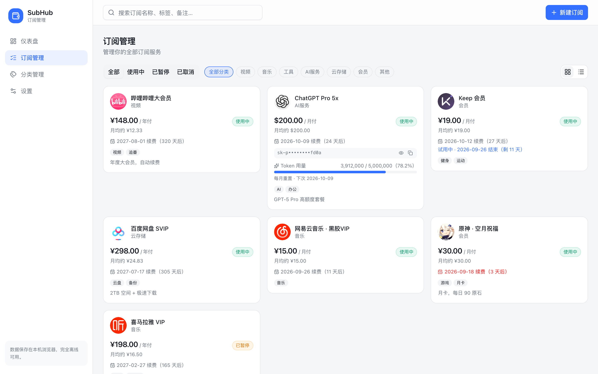
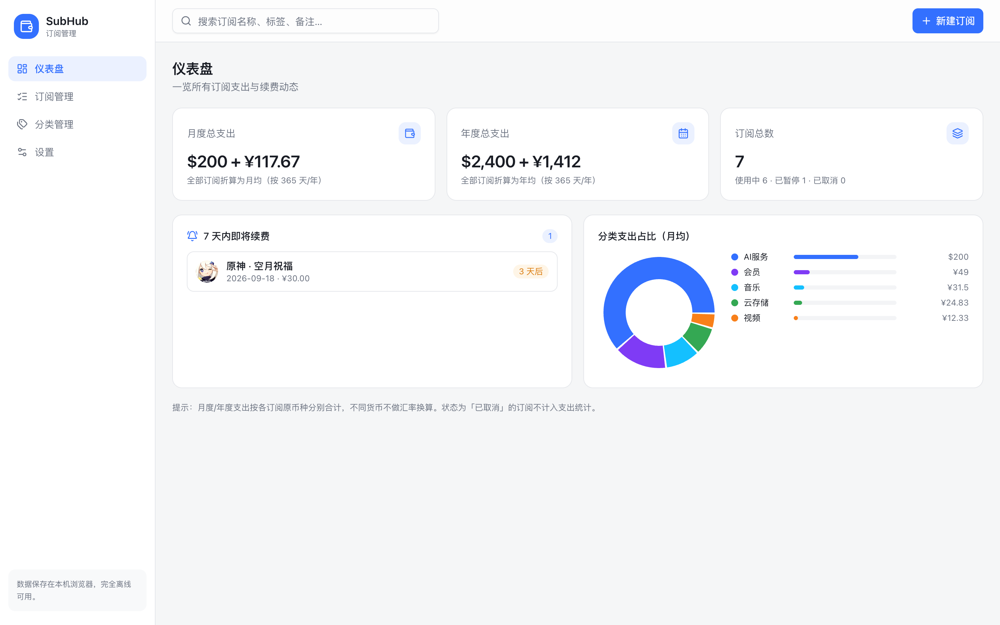
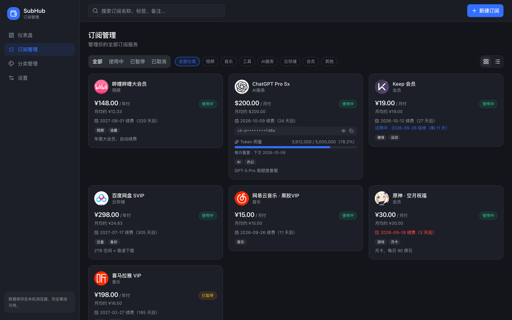

# SubHub · 订阅管理

一个**完全本地离线**的订阅管理网页应用，帮助你集中管理各种订阅服务。飞书（Lark）风格设计，数据只保存在你自己的浏览器里，无需联网、无需注册。

  

## 📸 界面截图

> 截图中的示例数据来自 [demo-data.json](docs/demo-data.json)（哔哩哔哩大会员、ChatGPT Pro 5x、Keep 会员、百度网盘 SVIP、网易云音乐黑胶 VIP、原神空月祝福、喜马拉雅 VIP），可在应用内「设置 → 导入 JSON」一键导入体验；订阅卡片图标为各产品官方 Logo（源图见 [docs/logos/](docs/logos/)）。

| 订阅管理 · 网格视图（浅色） | 仪表盘（浅色） |
| :---: | :---: |
|  |  |

| 订阅管理 · 深色模式 |
| :---: |
|  |

## ✨ 功能特性

### 📦 订阅管理
- 完整的增删改查：名称、金额、6 种货币、6 种计费周期（周/月/季/半年/年/自定义天数）
- 下次续费日期按周期**自动推算**，表单内实时预览
- 支付方式、标签、备注、状态（使用中 / 已暂停 / 已取消）、试用期标记
- 网格 / 列表双视图切换，搜索 + 分类筛选

### 🤖 AI 订阅专属字段
- API 接口地址（Endpoint）
- API Key 掩码显示（`sk-d••••fd0a`），一键显示 / 复制
- Token 总额度 / 已用额度，动画进度条展示（用量 ≥85% 变红警示）
- 额度重置周期（每日 / 每月 / 永不）与下次重置日期

### 🎨 高度可定制
- 浅色 / 深色 / 跟随系统主题
- 6 套强调色（默认飞书蓝 `#3370FF`），一键切换
- 自定义分类：内置 7 个分类，可自由增删（删除时订阅自动归入「其他」）
- 默认货币、365/360 天折算方式、仪表盘统计卡片独立开关

### 🖼️ 三套图标体系
- **手绘风 SVG 图标集**：32 个可爱手绘风内联 SVG（马卡龙配色 + 暖棕描边），专为订阅场景设计
- **Emoji**：24 个常用 emoji
- **自定义图片**：上传本地图片，圆形取景框裁剪（拖拽移动 + 滑块缩放），导出 256×256 圆形 PNG

### 📊 仪表盘
- 月度 / 年度总支出（任意周期自动折算）
- 订阅总览与状态分布
- 7 天内即将续费提醒（≤2 天红色警示）
- 分类支出环形图 + 占比动画条

### 💾 数据与离线
- 全部数据存于浏览器 `localStorage`，零运行时网络请求
- 内置 8 条示例数据，支持导出 / 导入 JSON 备份迁移
- 系统字体栈 + 内联图标，断网也能完整使用

## 🚀 快速开始

```bash
# 安装依赖
npm install

# 开发模式（改代码即时生效）→ http://localhost:3000/
npm run dev

# 生产构建 → dist/
npm run build

# 预览构建结果 → http://localhost:4173/
npm run preview
```

> ⚠️ **端口与数据的重要提示**
>
> 浏览器数据（localStorage）按「域名 + 端口」隔离，**换端口 = 换了一份数据**。
> 本项目的 preview 端口已固定为 `4173`（`--strictPort`），请固定使用
> `http://localhost:4173/` 访问。如需迁移不同端口间的数据，请使用应用内
> 「设置 → 导出 JSON / 导入 JSON」。

## 🛠️ 技术栈

- **框架**：React 19 + TypeScript + Vite
- **UI**：Tailwind CSS + shadcn/ui（40+ 组件）+ Radix UI
- **动画**：Framer Motion
- **图表**：Recharts
- **图标**：lucide-react + 内置手绘风 SVG 图标集
- **存储**：浏览器 localStorage（无后端）

## 📁 项目结构

```
src/
├── App.tsx                  # 布局：侧边栏 + 顶栏 + 页面路由
├── components/
│   ├── icons/               # 32 个手绘风 SVG 图标
│   ├── SubIcon.tsx          # 统一图标渲染（emoji / svg / 图片）
│   ├── ImageCropDialog.tsx  # 圆形裁剪对话框
│   └── ui/                  # shadcn/ui 组件
├── hooks/
│   ├── useLocalStorage.ts   # 持久化 Hook
│   ├── useSubscriptions.ts  # 订阅 CRUD + 示例数据 + 导入导出
│   ├── useCategories.ts     # 分类管理
│   └── useSettings.ts       # 主题 / 强调色 / 偏好设置
├── lib/billing.ts           # 周期折算、续费推算、货币格式化
├── sections/                # 仪表盘 / 订阅列表 / 表单 / 分类 / 设置
└── types/subscription.ts    # 类型定义与常量
```

## 📝 说明

- 多币种不做汇率换算（离线无汇率数据源），支出按币种分别合计
- 自定义图片图标以 dataURL 存储在浏览器中，导出 JSON 时会一并包含
- 清除浏览器站点数据会删除全部订阅，请定期「导出 JSON」备份

## License

MIT
